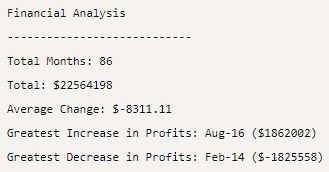
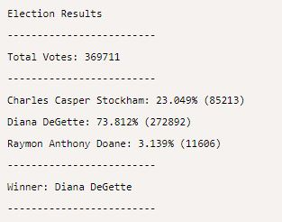

# Unveiling Insights with Python: Financial Data and Election Analysis

## Introduction
This project delve into Python's capabilities to analyse distinct datasets – financial records and election poll data. The financial dataset, "budget_data.csv," holds "Date" and "Profit/Losses" columns, while the election dataset, "election_data.csv," captures "Voter ID," "County," and "Candidate" details. Through financial analysis, we aim to extract essential metrics like total months, net "Profit/Losses," average changes, and significant profit fluctuations. Also, through election analysis, we aim to extract total votes, candidates' performance percentages and counts, ultimately revealing the winner by popular vote. This journey bridges data and insights, showcasing Python's prowess in translating raw data into meaningful narratives. By exploring diverse datasets, we tap into Python's analytical prowess, allowing us to make informed decisions through data exploration and analysis.

## Source of Data
Within Resources Folder in the PyBank and PyPoll folders:
* budget_data.csv
* election_data.csv

## Findings

### PyBank

* The analysis of the 'budget_data.csv' dataset reveals intriguing financial insights over a span of 86 months. The total cumulative profit/loss during this period amounts to a substantial $22,564,198. The dataset showcases a range of fluctuations, with an average monthly change of -$8,311.11.
* The most remarkable observation pertains to the greatest increase in profits, occurring in August 2016, with an impressive increase of $1,862,002. This indicates a potentially successful financial strategy or event during that month. Conversely, the most significant decrease in profits occurred in February 2014, registering a drop of -$1,825,558. This period could warrant further investigation into the factors contributing to this downturn.

### PyPoll

* The analysis of the 'election_data.csv' dataset provides a comprehensive view of the election results, reflecting a total of 369,711 votes cast. The election showcased a competitive contest among three candidates: Charles Casper Stockham, Diana DeGette, and Raymon Anthony Doane. Diana DeGette emerged as the clear victor with an overwhelming 73.812% of the total votes, totaling 272,892 votes in her favor.
* Charles Casper Stockham secured 23.049% of the votes, indicating a notable level of support but falling behind DeGette. Raymon Anthony Doane received 3.139% of the votes, highlighting a smaller yet significant portion of the electorate.
* The outcome reveals a strong mandate for Diana DeGette, who garnered the majority of votes and was declared the winner of the election. Her substantial support demonstrates her popularity and resonance with the electorate, positioning her as a prominent figure in the political landscape.

## Conclusion
